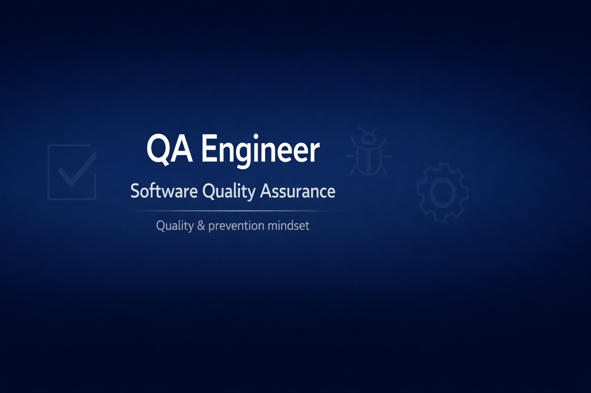

Md

  

## Hi there 👋 I'm Jessica

<!--
**jekajimenez1020-gif/jekajimenez1020-gif** is a ✨ _special_ ✨ repository because its `README.md` (this file) appears on your GitHub profile.

Here are some ideas to get you started:

💻 **QA Engineer | Software Testing & Quality Assurance**  
🏭 **Industrial Safety & Occupational Hygiene Engineer**

I am a QA Engineer with a strong background in **quality, prevention, and continuous improvement**, combining software testing with industrial safety principles to deliver reliable, user-focused, and risk-aware solutions.

I am passionate about **building quality from the beginning**, preventing defects, and ensuring that both **systems and processes are safe, efficient, and compliant**.

---

### 🔍 What I do
- Manual testing (functional, regression, exploratory)
- Test case design and execution
- Bug reporting and tracking
- Quality assurance mindset applied to software and processes
- Risk analysis and prevention-oriented testing

---

### 🌱 Currently learning
- Automation testing fundamentals
- API testing
- Agile & Scrum best practices
- Continuous improvement applied to software quality

---

### 🧠 Background that adds value
My experience in **Industrial Safety and Occupational Hygiene** allows me to:
- Analyze risks systematically
- Apply preventive thinking to software quality
- Focus on compliance, standards, and process optimization
- Communicate effectively with multidisciplinary teams

---

### 🚀 Goals
- Grow as a QA Engineer in tech-driven teams
- Contribute to high-quality, reliable software products
- Continue learning automation and modern QA tools

---

### 📫 How to reach me
- 📧 Email: **jekajimenez1020@gmail.com**
- 💼 LinkedIn: [linkedin.com/in/jessica-jiménez-tester-sst](https://www.linkedin.com/in/jessica-jiménez-tester-sst/)

---

✨ *Quality is not the final step — it’s a way of thinking.*
