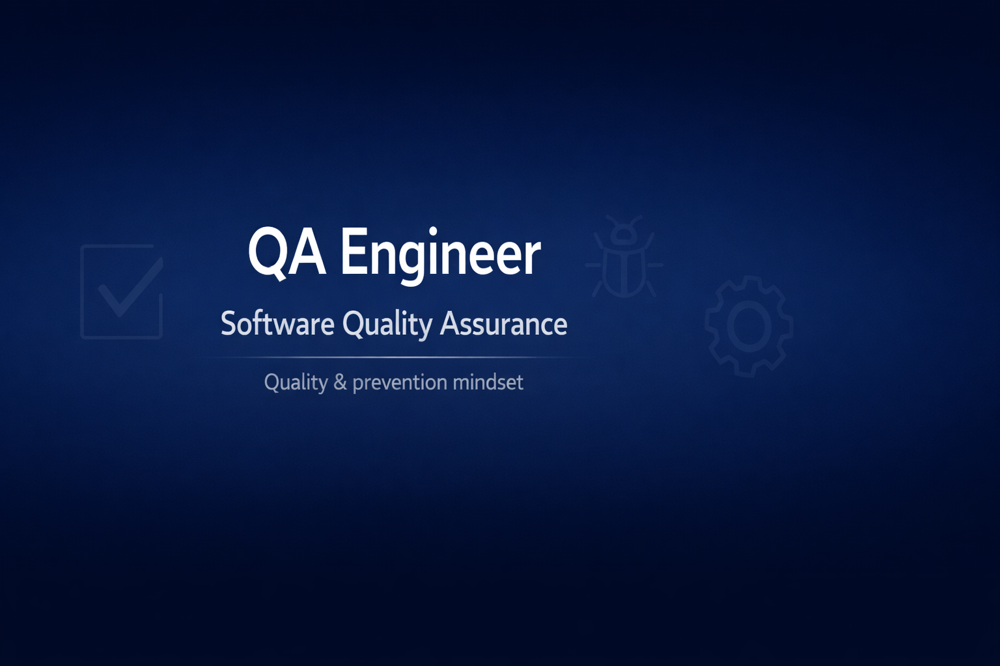

  

## 👋 Hola, soy Jessica Jiménez  

💻 **QA Engineer | Pruebas de Software y Aseguramiento de Calidad**  
🏭 **Ingeniera en Seguridad Industrial e Higiene Ocupacional**

Soy QA Engineer con una base sólida en **calidad, prevención y mejora continua**, combinando pruebas de software con principios de seguridad industrial para entregar soluciones confiables, centradas en el usuario y orientadas a la gestión del riesgo.

Me apasiona **construir calidad desde el inicio**, prevenir errores y asegurar que tanto los **sistemas como los procesos sean seguros, eficientes y cumplan con los estándares**.

---

### 🔍 ¿Qué hago?
- Pruebas manuales (funcionales, regresión y exploratorias)
- Diseño y ejecución de casos de prueba
- Reporte y seguimiento de bugs (Jira)
- Análisis de riesgos y pruebas orientadas a la prevención
- Enfoque de calidad aplicado a software y procesos

---

### 🌱 Actualmente estoy reforzando 
- Fundamentos de automatización de pruebas
- Pruebas de API (Postman)
- Metodologías ágiles (Scrum)
- Mejora continua aplicada a calidad de software

---

### 🧠 Valor diferencial
Mi experiencia en **Seguridad Industrial e Higiene Ocupacional** me permite:
- Analizar riesgos de forma estructurada
- Aplicar pensamiento preventivo al testing
- Enfocarme en cumplimiento de normas y optimización de procesos
- Comunicarme eficazmente con equipos multidisciplinarios

---

### 🚀 Objetivos profesionales
- Crecer como QA Engineer en equipos tecnológicos
- Aportar a productos de software confiables y de alta calidad
- Seguir fortaleciendo habilidades en automatización y herramientas QA modernas

---

### 📂 Proyectos destacados

| Proyecto | Tipo de Testing | Tecnologías | Descripción | Enlace |
|----------|----------------|-------------|-------------|--------|
| 1. 🛴 Urban Scooter | Web, Mobile, API (Manual) | Jira, Postman, Chrome, Opera, Android Studio | Testing integral enfocado en validación funcional, datos y backend | [Ver repositorio](https://github.com/jekajimenez1020-gif/qa-testing-project-Urban-Scooter) |
| 2. 🚗 Urban Routes | Automatización E2E | Python, Selenium, PyTest | Automatización del flujo completo de solicitud de transporte | [Ver repositorio](https://github.com/jekajimenez1020-gif/qa-project-Urban-Routes-es) |

#### 1. 🛴 Urban Scooter – Testing integral (Web, Mobile y API)

Proyecto enfocado en la validación de una aplicación de alquiler de scooters eléctricos, donde se realizaron pruebas completas en **web, mobile y API**, cubriendo funcionalidades clave del sistema.

🔍 **Actividades realizadas:**

**🌐 Aplicación Web:**
- Creación de checklist para validar los requisitos de la pantalla **"Estado del pedido"**
- Diseño de casos de prueba para la pantalla **"Hacer pedido"** (validación de campos)
- Ejecución de pruebas en múltiples navegadores: **Google Chrome y Opera**
- Validación funcional basada en checklist y datos de prueba
- Reporte y seguimiento de errores en Jira

**📱 Aplicación Mobile (App para repartidores):**
- Uso de emulador Android mediante Android Studio para ejecución de pruebas
- Validación del flujo de usuario:
  - Inicio de sesión de repartidores
  - Visualización de pedidos disponibles
  - Selección y gestión de pedidos
- Diseño de casos de prueba para:
  - Notificaciones
  - Comportamiento sin conexión a internet
- Ejecución de pruebas funcionales enfocadas en la experiencia del repartidor

**🔌 Pruebas de API:**
- Creación y validación de checklist para el backend
- Pruebas de endpoints:
  - Gestión de repartidores
  - Consulta de pedidos
  - Cancelación de pedidos

---

📊 **Resultados:**
- 🐞 5 bugs detectados en funcionalidades de estado del pedido (Web)
- 🐞 11 bugs relacionados con validación de datos (Web)
- 🐞 3 bugs en notificaciones (Mobile)
- 🐞 1 bug en eliminación de pedidos (API)

---

🛠️ **Herramientas utilizadas:**
- Jira (gestión de bugs)
- Navegadores: Chrome, Opera
- Postman (API testing)
- Android Studio (Emulador Mobile)

---

🎯 **Valor aportado:**
Este proyecto permitió aplicar pruebas en múltiples plataformas, detectar errores críticos y asegurar la calidad del sistema desde una perspectiva integral, enfocada en la experiencia del usuario y la prevención de fallos.

#### 2. 🚗 Urban Routes – Automatización de pruebas end-to-end

Proyecto enfocado en la automatización de pruebas para una aplicación web de solicitud de transporte, cubriendo el flujo completo del usuario desde la configuración del viaje hasta la asignación del conductor.

🔍 **Actividades realizadas:**
- Automatización del flujo completo de solicitud de taxi:
  - Configuración de rutas
  - Selección de tarifas
  - Registro de número de teléfono
  - Adición de método de pago
  - Envío de mensaje al conductor
  - Solicitud de servicios adicionales (manta, pañuelos, helados)
  - Solicitud del taxi
  - Validación de asignación de conductor
- Ejecución de pruebas end-to-end (E2E)
- Diseño de pruebas automatizadas dependientes para simular flujo real del usuario

---

🛠️ **Herramientas utilizadas:**
- Python
- Selenium WebDriver
- PyTest
- PyCharm

---

📊 **Resultados:**
- Automatización del flujo crítico principal del negocio
- Validación completa del proceso de solicitud de transporte
- Reducción del tiempo en pruebas repetitivas

---

🎯 **Valor aportado:**
Este proyecto permitió validar de forma automatizada un flujo completo del usuario, asegurando la estabilidad del sistema y simulando escenarios reales de uso, lo que mejora la confiabilidad del producto.

### 📫 Contacto
- 📧 Email: **jekajimenez1020@gmail.com**
- 💼 LinkedIn: https://www.linkedin.com/in/jessica-jiménez-tester-sst/

---

✨ *La calidad no es el paso final — es una forma de pensar.*
